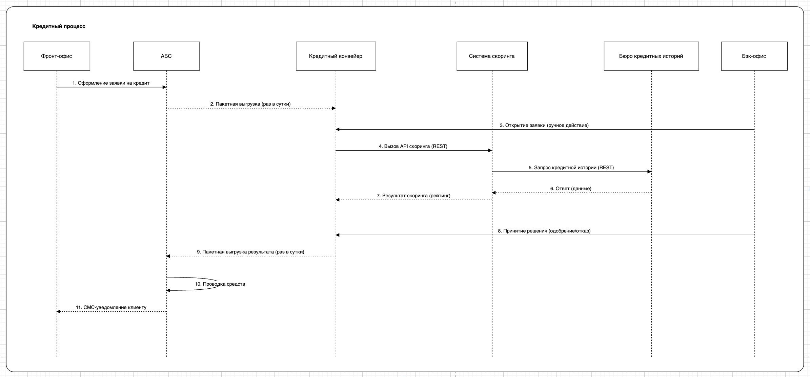
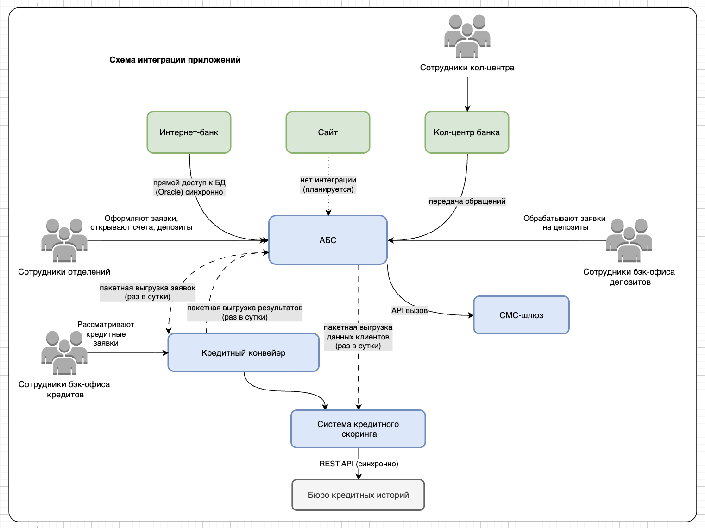

## Задание 1. Карта IT-ландшафта и схема интеграции приложений

### Цель работы
Оценить текущие процессы и IT‑ландшафт банка «Стандарт», выявить ограничения для цифровой трансформации и подготовить наглядные схемы, которые лягут в основу проектирования целевого состояния.

### 1. Карта IT‑ландшафта
- **Файл:** [Task1.drawio](drawio/Task1.drawio) (лист 1 - Карта IT-ландшафта)
- **Превью:** \

### 2. Диаграмма кредитного процесса (Диаграмма последовательности)
- **Файл:** [Task1.drawio](drawio/Task1.drawio) (лист 2 - Кредитный процесс)
- **Превью:** \

### 3. Схема интеграции приложений
- **Файл:** [Task1.drawio](drawio/Task1.drawio) (лист 3 - Схема интеграции приложений)
- **Превью:** \
