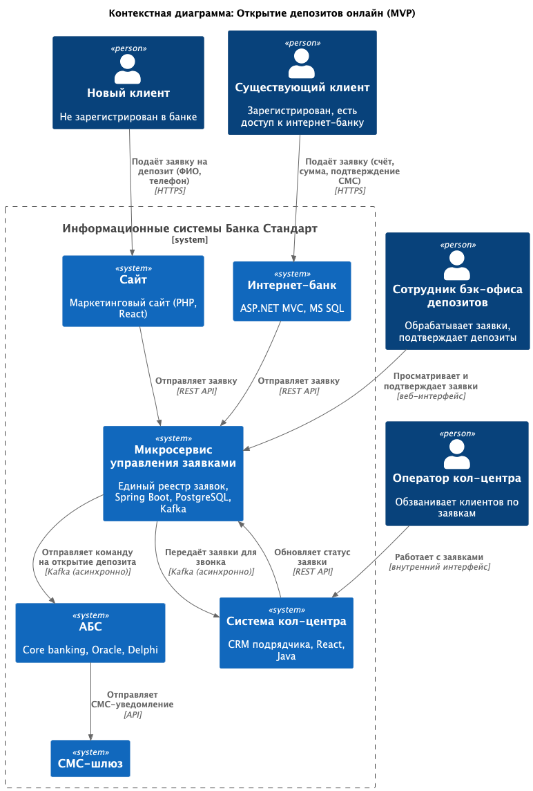
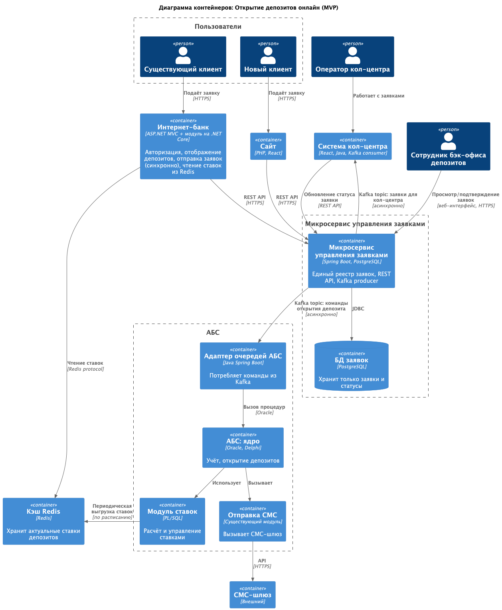

### **Название задачи: Открытие депозитов онлайн (MVP)** 
### **Автор: Команда цифровой трансформации**
### **Дата: 2026-04-03**
### **Функциональные требования**

| **№** | **Действующие лица или системы**                   | **Use Case**                              | **Описание**                                                                                                                                                                                                           |
|:-----:|:---------------------------------------------------|:------------------------------------------|:-----------------------------------------------------------------------------------------------------------------------------------------------------------------------------------------------------------------------|
|  UC1  | Новый клиент, Сайт, Кол-центр                      | Подача заявки на депозит с сайта          | Клиент на сайте  заполняет Ф.И.О. и телефон, видит список депозитов с актуальными ставками. После отправки заявка передаётся в кол-центр, менеджер связывается с клиентом.                                             |
|  UC2  | Существующий клиент, Интернет-банк, АБС, СМС-шлюзм | Подача заявки на депозит в интернет-банке | Клиент заходит в интернет-банк, видит список депозитов с актуальными ставкам и персональные ставки. Выбирает депозит, указывает счёт и сумму, подтверждает заявку СМС-кодом. Заявка сохраняется в АБС (через очередь). |
|  UC2  | Сотрудник бэк-офиса депозитов, АБС                 | Обработка заявки на депозит               | Сотрудник видит заявку в АБС, проверяет условия, подтверждает или отклоняет. После подтверждения клиенту приходит СМС.                                                                                                 |
|  UC4  | Сотрудник бэк-офиса депозитов и кредитов, АБС      | Управление ставками по депозитам          | Сотрудники имеют доступ к единому инструменту расчёта ставок (реализованному в АБС), заменяющему Excel.                                                                                                                |

### **Нефункциональные требования (ключевые)**

| **№** | **Требование**                                                                                                                                              |
|:-----:|:------------------------------------------------------------------------------------------------------------------------------------------------------------|
|  R1   | Все сервисы должны работать 24/7, доступность 99,9% (включая интернет-банк и новые функции).                                                                |
|  R2   | При сбое в основном ЦОД необходимо переключение на резервный ЦОД. Интернет-банк должен оставаться доступным.                                                |
|  R3   | АБС масштабируется только вертикально. Нужно избегать прямых вызовов из интернет-банка к API АБС.                                                           |
|  R5   | При сбоях заявки клиентов не должны теряться. Нужен механизм повторной обработки или очередь.                                                               |
|  P2   | Подача заявок не должна создавать критическую нагрузку на АБС. Использовать асинхронную передачу или очереди.                                               |
|  P4   | Кэширование справочных данных (ставки, условия) на уровне интернет-банка для снижения нагрузки на АБС.                                                      |
|  S2   | Для очередей рекомендована Kafka. Текущая платформа интернет-банка несовместима – возможен переход на микросервисы в рамках задачи депозитов.               |
|  +R1  | Защита чувствительных данных (Ф.И.О., телефон, паспорт) при передаче – шифрование трафика (TLS/SSL).                                                        |
|  +R3  | Прямая работа интернет-банка с API АБС в новом процессе запрещена (из-за перегрузки АБС). Нужны асинхронные каналы.                                         |
|  +R5  | Интернет-банк работает в одном ЦОД, резервный ЦОД не используется активно. Требование 99,9% доступности пока невыполнимо – нужно проектировать новую схему. |

### **Решение**
В качестве центрального элемента вводится микросервис управления заявками (Spring Boot, PostgreSQL). Он выступает единым реестром заявок на розничные продукты (депозиты, в перспективе — кредиты) и обеспечивает все взаимодействия между клиентскими каналами, кол-центром, бэк-офисом и АБС.

Основные потоки:
- Сайт и интернет-банк отправляют заявки в микросервис синхронно (REST).
- Микросервис асинхронно (Kafka) передаёт заявки в кол-центр для обзвона и команды на открытие депозита в АБС.
- Кол-центр обновляет статус заявки в Микросервисе синхронно (REST).
- Бэк-офис работает с заявками через веб-интерфейс микросервиса. После успешной обработки заявки Микросервис асинхронно (Kafka) отправляет команду в АБС на открытие депозита.

Дополнительные компоненты:
- Redis — кэш ставок (наполняется из АБС, читается интернет-банком).
- Адаптер очередей АБС (Java) — слушает Kafka и вызывает процедуры открытия депозита.

Технологический стек полностью совместим с существующей экспертизой банка: Java/Spring Boot (есть в команде АБС), .NET (интернет-банк), Oracle, PostgreSQL, Kafka, Redis.

| **№** | **Обоснование**                                                                                                                                                                                                                                                                         |
|-------|-----------------------------------------------------------------------------------------------------------------------------------------------------------------------------------------------------------------------------------------------------------------------------------------|
| R1,R2 | Микросервис, Kafka и Redis проектируются как кластеры (минимум 3 узла) с возможностью работы в двух ЦОД. Интернет-банк горизонтально масштабируется. АБС остаётся вертикальной, но нагрузка на неё сведена к минимуму.                                                                  |
| R3    | Все взаимодействия с АБС сделаны асинхронными через Kafka. Интернет-банк не вызывает АБС напрямую.                                                                                                                                                                                      |
| R5    | Kafka с подтверждением доставки (at-least-once) гарантирует сохранность заявок. Микросервис и кол-центр могут обрабатывать сообщения идемпотентно.                                                                                                                                      |
| P2    | Заявки не пишутся в АБС на этапе подачи. Они сохраняются в отдельную БД микросервиса (PostgreSQL). АБС получает только финальную команду после подтверждения бэк-офисом.                                                                                                                |
| P4    | Внедрён Redis как центральный кэш. Модуль ставок АБС периодически выгружает в Redis актуальные значения. Интернет-банк читает ставки напрямую из Redis, не обращаясь к АБС.                                                                                                             |
| S2    | Мы не стали внедрять Kafka непосредственно в интернет-банк из-за несовместимости его текущей платформы (ASP.NET MVC на .NET Framework 4.5). Вместо этого интернет-банк взаимодействует с микросервисом управления заявками синхронно через REST API.                                    |
| +R1   | Все внешние каналы (сайт, интернет-банк, API кол-центра) используют HTTPS. Внутренние Kafka-соединения защищены SASL/SSL.                                                                                                                                                               |
| +R5   | Текущая инфраструктура интернет-банка (один ЦОД, одна группа серверов) не обеспечивает 99,9% доступности. В архитектуру заложены компоненты для горизонтального масштабирования и резервный ЦОД, но полное выполнение требования требует дополнительного развёртывания и тестирования.  |

[Диаграмма контекста C4](c4/contex_diagram_MVP.puml) \

[Диаграмма контейнеров C4](c4/container_diagram_MVP.puml) \

### **Альтернативы**
| **Альтернатива**                                       | **Причина отклонения**                                                                                                                                                     |
|--------------------------------------------------------|----------------------------------------------------------------------------------------------------------------------------------------------------------------------------|
| Хранение заявок в АБС (без отдельного микросервиса)    | АБС перегружена, прямое обращение из интернет-банка запрещено (R3). Хранение заявок в АБС увеличило бы нагрузку на её БД.                                                  |
| Синхронный REST-вызов из интернет-банка в АБС          | Противоречит требованию R3 (избегать прямых вызовов) и создаёт риск перегрузки АБС при пиковых нагрузках.                                                                  |
| RabbitMQ вместо Kafka                                  | Банк в перспективе планирует использовать Kafka (S2). Экспертиза по Java позволяет работать с Kafka. RabbitMQ не даёт преимуществ для масштабируемости на больших объёмах. |
| Кэширование ставок в памяти интернет-банка (без Redis) | При горизонтальном масштабировании интернет-банка кэши на разных серверах будут несогласованы. Redis обеспечивает централизованный кэш и снижает нагрузку на АБС (P4).     |
| Адаптер очередей АБС на Delphi                         | У команды АБС есть экспертиза в Java, и Kafka проще интегрировать с Java. Delphi не имеет родной поддержки Kafka, что усложнило бы разработку.                             |

**Недостатки, ограничения, риски**

Недостатки:
- Дополнительная сложность – введение нового микросервиса, Kafka, Redis увеличивает количество движущихся частей и требует их поддержки.
- Задержка при синхронном вызове – интернет-банк обращается к микросервису синхронно (REST), что при пиковых нагрузках может увеличить время отклика (но это компенсируется горизонтальным масштабированием).
- Неполное использование Kafka – из-за несовместимости интернет-банка с Kafka мы не получаем преимуществ асинхронности на первом шаге (только на последующих).
- Дублирование ставок – ставки хранятся и в АБС (источник истины), и в Redis, что создаёт риск рассинхронизации (хотя обновление происходит часто).

Ограничения:
- АБС остаётся монолитной – её невозможно горизонтально масштабировать, что при очень высокой нагрузке может стать узким местом (даже при асинхронной передаче команд).
- Требование 99,9% доступности пока невыполнимо – текущая инфраструктура (один ЦОД, одна группа серверов) не обеспечивает его; для полной реализации нужны дополнительные инвестиции и тестирование.
- Нет готового веб-интерфейса для бэк-офиса – его нужно разрабатывать с нуля (микросервис предоставляет API, но нужен UI).
- Интеграция с системой кол-центра – требует доработки со стороны кол-центра (подписка на Kafka, реализация REST-вызовов), что может занять время.

Риски:
- Отсутствие экспертизы по Redis – в банке может не быть опыта работы с Redis, что приведёт к ошибкам в настройке кластера, потере данных или проблемам с производительностью.
- Нагрузка на АБС при выгрузке ставок – если модуль ставок будет выгружать данные слишком часто, это может создать дополнительную нагрузку на БД АБС (компенсируется редкими обновлениями – раз в минуту или по изменению).
- Сложность отладки асинхронных сценариев – при сбоях в Kafka или неправильной конфигурации заявки могут «зависнуть» в очереди, и их сложнее отслеживать без дополнительного мониторинга.
- Риск дублирования заявок – если идемпотентность не будет реализована правильно, клиент при повторной отправке может создать несколько заявок.
- Зависимость от подрядчика по кол-центру – система кол-центра поддерживается подрядчиком; его потребуется дорабатывать (Kafka consumer, REST API), что может привести к дополнительным затратам и срокам.

