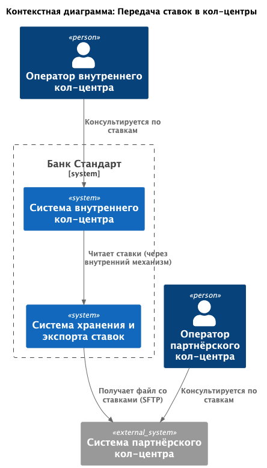
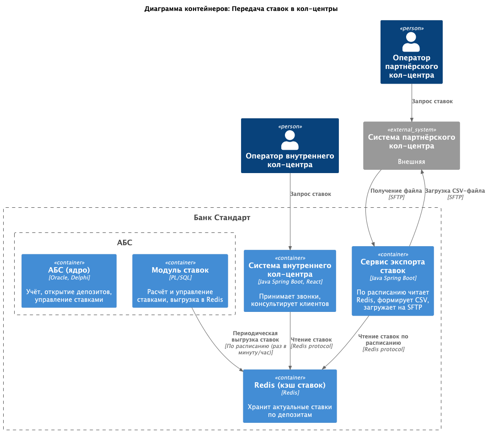
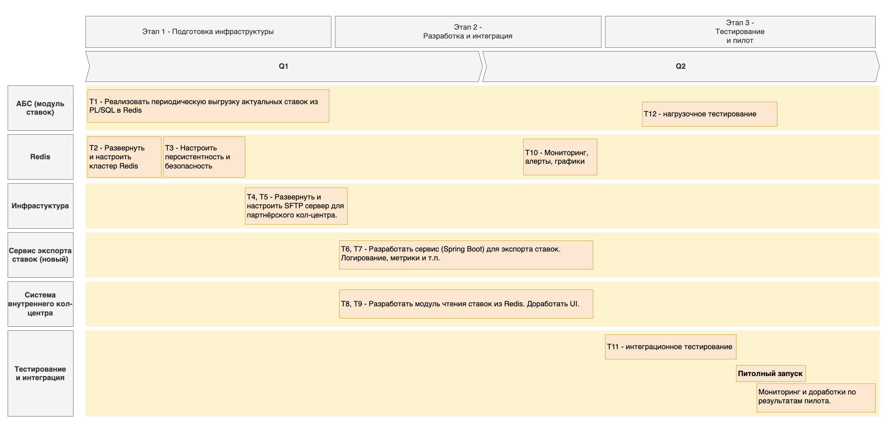

### **Название задачи: Обеспечение доступа к актуальным депозитным ставкам для кол-центров**
### **Автор: Команда цифровой трансформации**
### **Дата: 2026-04-04**
### **Функциональные требования (Use Cases)**

| **№** | **Действующие лица или системы**                    | **Use Case**                    | **Описание**                                                                                    |
|:-----:|:----------------------------------------------------|:--------------------------------|:------------------------------------------------------------------------------------------------|
|  UC1  | Оператор внутреннего кол-центра, Система кол-центра | Консультация клиента по ставкам | Оператор в режиме реального времени получает актуальные ставки по депозитам для ответа клиенту. |
|  UC2  | Партнёрский кол-центр, Банк (система экспорта)      | Получение файла со ставками     | Партнёрский кол-центр забирает файл (CSV/Excel) через SFTP не реже 1 раза в час.                |
|  UC3  | Администратор                                       | Настройка расписания экспорта   | Настройка периодичности и формата выгрузки ставок для партнёра.                                 |

### **Нефункциональные требования**
| **№** | **Требование**                                                                                                 |
|:-----:|:---------------------------------------------------------------------------------------------------------------|
|  NF1  | Внутренний кол-центр должен получать ставки с задержкой не более 5 секунд (online).                            |
|  NF2  | Партнёрский кол-центр получает файл не реже 1 раза в час.                                                      |
|  NF3  | Данные о ставках защищены при передаче (SFTP, HTTPS).                                                          |
|  NF4  | Выгрузка файлов не должна создавать дополнительную нагрузку на АБС (использовать уже существующий кэш Redis).  |

### **Решение**
**Для внутреннего кол-центра:**
- Система кол-центра (Java Spring Boot) расширяется: добавляется прямой доступ к Redis (кэш ставок). Поскольку система развёрнута в инфраструктуре банка и поддерживается командой, имеющей Java-экспертизу, это технически выполнимо.
- При запросе оператора кол-центр читает актуальные ставки из Redis и отображает их.
  
Обоснование:
- Упрощение архитектуры – не нужен дополнительный прокси-микросервис.
- Скорость – прямое подключение к Redis минимально задерживает ответ.
- Безопасность – Система кол-центра и Redis развёрнуты в закрытой сети банка, доступ к Redis можно ограничить по сети и паролем.
- Использование существующей экспертизы – команда банка (Java) может доработать кол-центр.

**Для партнёрского кол-центра:**
- Создаётся сервис экспорта ставок (Java Spring Boot), который по расписанию (раз в час) читает ставки из Redis, формирует CSV-файл и выгружает на SFTP-сервер для партнёра.

Обоснование:
- Отдельный сервис не смешивает ответственности и позволяет масштабировать экспорт независимо от другого сервиса, куда можно было бы добавить этот функционал.
- При росте нагрузки или изменении формата файла правки затронут только сервис экспорта.
- Используется существующая Java-экспертиза.

[Диаграмма контекста](c4/context_diagram_rates.puml) \

[Диаграмма контейнеров](c4/container_diagram_rates.puml) \

### **Альтернативы**
| **Альтернатива**                                                                     | **Причина отклонения**                                                                                                                                                                                                                                            |
|--------------------------------------------------------------------------------------|-------------------------------------------------------------------------------------------------------------------------------------------------------------------------------------------------------------------------------------------------------------------|
| Партнёрский кол-центр получает ставки через REST API                                 | Партнёр не поддерживает API-вызовы, только файловый обмен.                                                                                                                                                                                                        |
| Выгрузка ставок из АБС напрямую в файл (без Redis)                                   | Создаст дополнительную нагрузку на перегруженную АБС (нарушение требований R3). Также сложнее обеспечить актуальность для внутреннего кол-центра.                                                                                                                 |
| Внутренний кол-центр получает ставки через микросервис заявок (как прокси)           | Добавляет лишний сетевой вызов и точку отказа, увеличивает задержку. Добавляет лишний функционал микросервису, который к нему не имеет отношения. При прямом доступе к Redis проще и быстрее, тем более что система кол-центра развёрнута в инфраструктуре банка. |
| Единый сервис экспорта для партнёра и внутреннего кол-центра                         | У них разные протоколы (SFTP vs. Redis), разные требования к частоте и задержкам. Объединение усложнит логику.                                                                                                                                                    |
| Отказ от отдельного сервиса экспорта, реализация экспорта внутри микросервиса заявок | Микросервис заявок получит дополнительную ответственность (экспорт), что нарушает принцип единственной обязанности и усложнит его масштабирование. Отдельный сервис легче дорабатывать и мониторить.                                                              |
| Использование электронной почты для отправки файлов партнёру                         | Небезопасно, нет гарантии доставки, не поддерживает автоматическую загрузку со стороны партнёра. SFTP является стандартом для B2B обмена.                                                                                                                         |

**Недостатки, ограничения, риски**

Недостатки:
- Введение отдельного сервиса экспорта ставок увеличивает количество компонентов и сложность поддержки.
- Партнёрский кол-центр получает данные с задержкой (раз в час) – не подходит для сценариев, требующих актуальности в реальном времени.
- Внутренний кол-центр напрямую зависит от доступности Redis (при сбое Redis операторы не смогут получить ставки).

Ограничения:
- Партнёрский кол-центр не поддерживает API, только файловый обмен через SFTP – это ограничивает частоту обновления и исключает синхронный запрос.
- Частота обновления ставок ограничена расписанием выгрузки из АБС в Redis (например, раз в минуту) и экспорта в файл (раз в час).
- Требуется доработка системы внутреннего кол-центра (подрядчик или внутренние Java-специалисты), что может занять время и потребовать бюджета.

Риски:
- Производительность Redis: большой поток запросов от операторов кол-центра (сотни одновременных вызовов) может создать нагрузку на Redis. \
Что делать: горизонтальное масштабирование Redis (кластер), кэширование на стороне кол-центра (кратковременное хранение ставок в памяти приложения).
- Устаревшие ставки у партнёра: если сервис экспорта не отработает по расписанию (сбой, сетевые проблемы), партнёр будет использовать старый файл. \
Что делать: мониторинг и алерты на каждый успешный экспорт, повторные попытки с экспоненциальной задержкой, логирование ошибок.
- Безопасность SFTP: компрометация учётных данных или перехват трафика может привести к утечке ставок. \
Что делать: использование ключей SSH вместо паролей, ограничение IP-адресов для входящих подключений, ротация ключей, шифрование файлов (опционально).
- Задержка выгрузки из АБС: если ставки изменились в АБС, но ещё не попали в Redis (из-за расписания), клиент получит неверную информацию.
Что делать: минимизация интервала выгрузки (раз в минуту) или переход на триггерную выгрузку при изменении ставок в АБС.
- Зависимость от подрядчика – внутренний кол-центр поддерживается сторонней компанией; её ресурсы могут быть ограничены. \
Что делать: заключить SLA, выделить внутреннего Java-специалиста для мелких доработок.

**Список крупных задач для каждой системы**

| **Система**                    | **Задачи**                                                                                                                                                                                                                                                                      |
|--------------------------------|---------------------------------------------------------------------------------------------------------------------------------------------------------------------------------------------------------------------------------------------------------------------------------|
| АБС (модуль ставок)            | **T1.** Реализовать периодическую выгрузку актуальных ставок из PL/SQL в Redis (раз в минуту/час).                                                                                                                                                                              |
| Redis                          | **T2.** Развернуть и настроить кластер Redis.   **T3.** Настроить персистентность (RDB/AOF) и безопасность (пароль, сетевые ограничения).   **T10.** Обеспечить мониторинг доступности Redis (алерты, графики).   **T12.** Провести нагрузочное тестирование Redis. |
| Система внутреннего кол-центра | **T8.** Разработать модуль чтения ставок из Redis.   **T9.** Доработать UI оператора для отображения ставок.                                                                                                                                                                |
| Сервис экспорта ставок (новый) | **T6**. Разработать сервис (Spring Boot) для экспорта ставок: чтение из Redis, генерация CSV, загрузка на SFTP по расписанию.   **T7**. Добавить логирование, метрики и повторные попытки.                                                                                  |
| Инфраструктура                 | **T4.** Развернуть SFTP сервер для партнёрского кол-центра.   **T5.** Настроить сетевые доступы (Redis для кол-центра, SFTP для сервиса экспорта).                                                                                                                          |
| Тестирование и интеграция      | **T11.**  Провести интеграционное тестирование (чтение ставок кол-центром, экспорт файла)   **Т13.** Выполнить пилотное подключение партнёрского кол-центра                                                                                                                 |

**Roadmap**

[RoadMap_bank_Standart.drawio](drawio/RoadMap_bank_Standart.drawio)
