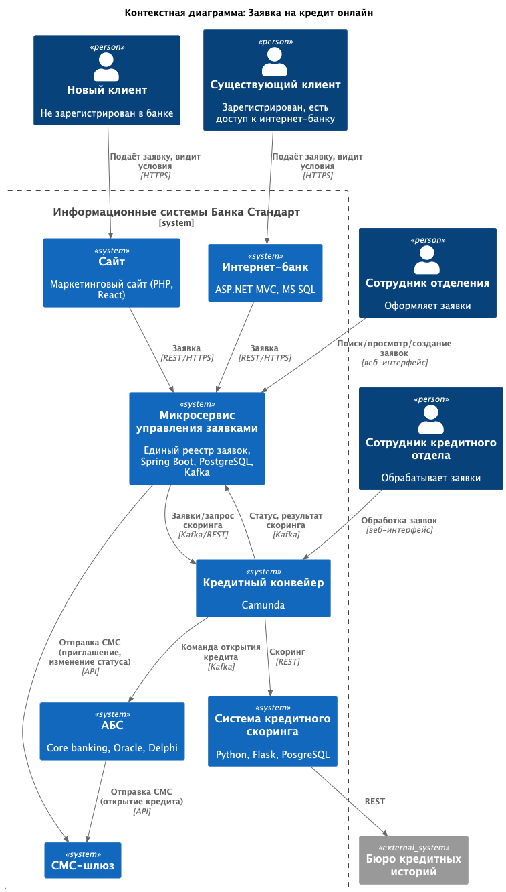
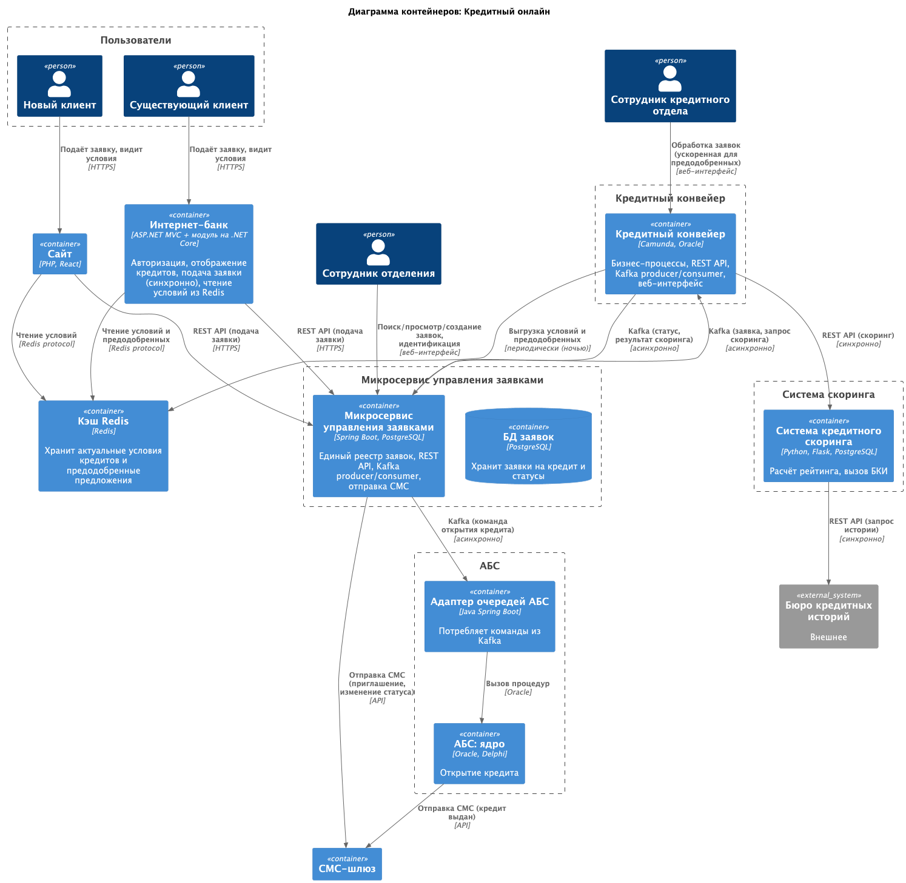

## **Название задачи: Заявка на кредит онлайн**
### **Автор: Команда цифровой трансформации**
### **Дата: 2026-04-05**
### **Функциональные требования (Use Cases)**

| **№** | **Действующие лица или системы**                                         | **Use Case**                                        | **Описание**                                                                                                                                                                        |
|:-----:|:-------------------------------------------------------------------------|:----------------------------------------------------|:------------------------------------------------------------------------------------------------------------------------------------------------------------------------------------|
|  UC1  | Новый клиент, Сайт, Микросервис заявок, Кредитный конвейер, Скоринг, БКИ | Подача заявки на сайте с паспортными данными        | Клиент заполняет ФИО, телефон, паспортные данные на сайте. Микросервис через конвейер синхронно вызывает скоринг, возвращает решение. Заявка сохраняется. СМС о визите в отделение. |
|  UC2  | Новый клиент, Сайт, Микросервис заявок                                   | Подача заявки на сайте без паспортных данных        | Только ФИО и телефон. Заявка сохраняется в микросервисе. СМС о визите.                                                                                                              |
|  UC3  | Существующий клиент, Интернет-банк, Микросервис заявок                   | Подача заявки через интернет-банк                   | Клиент выбирает кредитный продукт, указывает счёт, подтверждает СМС. Заявка сохраняется в микросервисе.                                                                             |
|  UC4  | Существующий клиент, Интернет-банк, Микросервис заявок                   | Предодобренное предложение                          | Клиент видит предодобренную сумму (из ночного расчёта). При подаче – упрощённая проверка.                                                                                           |
|  UC5  | Сотрудник отделения, Микросервис заявок                                  | Продолжение работы с заявкой, созданной онлайн      | Сотрудник находит заявку в микросервисе (а не АБС), проводит идентификацию, завершает оформление.                                                                                   |
|  UC6  | Сотрудник отделения, Микросервис заявок                                  | Создание новой заявки для клиента без онлайн-заявки | Сотрудник создаёт заявку в микросервисе.                                                                                                                                            |
|  UC7  | Сотрудник кредитного отдела, Кредитный конвейер                          | Обработка заявки (ускоренная для предодобренных)    | Сотрудник принимает решение. Конвейер отправляет команду в АБС. В микросервисе обновляется статус заявки.                                                                           |
|  UC8  | Клиент, СМС-шлюз                                                         | Получение уведомлений                               | Клиент получает СМС о необходимости визита, изменении статуса, одобрении.                                                                                                           |

### **Нефункциональные требования (ключевые)**

| **№** | **Требование**                                                                                                                                              |
|:-----:|:------------------------------------------------------------------------------------------------------------------------------------------------------------|
|  R1   | Все сервисы должны работать 24/7, доступность 99,9% (включая интернет-банк и новые функции).                                                                |
|  R2   | При сбое в основном ЦОД необходимо переключение на резервный ЦОД. Интернет-банк должен оставаться доступным.                                                |
|  R3   | АБС масштабируется только вертикально. Нужно избегать прямых вызовов из интернет-банка к API АБС.                                                           |
|  R4   | Система кредитного скоринга важна для работы банка, не должна перегружаться дополнительными предрасчётами.                                                  |
|  R5   | При сбоях заявки клиентов не должны теряться. Нужен механизм повторной обработки или очередь.                                                               |
|  P2   | Подача заявок не должна создавать критическую нагрузку на АБС. Использовать асинхронную передачу или очереди.                                               |
|  P4   | Кэширование справочных данных (ставки, условия) на уровне интернет-банка для снижения нагрузки на АБС.                                                      |
|  S2   | Для очередей рекомендована Kafka. Текущая платформа интернет-банка несовместима – возможен переход на микросервисы в рамках задачи депозитов.               |
|  +R1  | Защита чувствительных данных (Ф.И.О., телефон, паспорт) при передаче – шифрование трафика (TLS/SSL).                                                        |
|  +R3  | Прямая работа интернет-банка с API АБС в новом процессе запрещена (из-за перегрузки АБС). Нужны асинхронные каналы.                                         |
|  +R4  | Текущий обмен между АБС и кредитным конвейером – раз в сутки. Ускорить невозможно (техническое ограничение). Требуется пересмотр интеграции.                |
|  +R5  | Интернет-банк работает в одном ЦОД, резервный ЦОД не используется активно. Требование 99,9% доступности пока невыполнимо – нужно проектировать новую схему. | 

### **Решение**
- **Микросервис управления заявками** (единый реестр для депозитов и кредитов):
    - Хранит все кредитные заявки.
    - Предоставляет REST API для сайта и интернет-банка. 
    - При подаче заявки с паспортными данными синхронно вызывает кредитный конвейер (REST), который выполняет скоринг и возвращает решение клиенту. 
    - Отправляет заявку в кредитный конвейер через Kafka для асинхронной обработки.
    - Получает от конвейера обновления статуса через Kafka. 
    - Предоставляет веб-интерфейс для сотрудников отделения (поиск, создание, идентификация). 
    - Не участвует в открытии кредита – только конвейер.
    - Управляет СМС-ведомлениями о статусах заявок:
      - При подаче заявки (с паспортными данными или без) – отправляет СМС о необходимости визита в отделение.
      - При изменении статуса заявки (одобрение, отказ) – отправляет соответствующее СМС клиенту.
- **Кредитный конвейер:**
    - Принимает заявки от микросервиса через Kafka. 
    - Предоставляет синхронный REST API для скоринга (по запросу от микросервиса заявок). 
    - Управляет бизнес-процессами обработки заявок. 
    - После одобрения сотрудником кредитного отдела отправляет команду на открытие кредита в АБС через Kafka. 
    - Отправляет обновления статуса в микросервис заявок через Kafka. 
    - Расчёт предодобренных предложений выполняется один раз в сутки (ночью) с вызовом скоринга (вне пиковых часов). Результат сохраняется в Redis. 
    - Периодически выгружает в Redis актуальные условия кредитов (раз в час).
- **АБС:**
    - Получает команду на открытие кредита от конвейера через Kafka. 
    - Открывает кредит и отправляет СМС через СМС-шлюз. 
    - Пакетный обмен с конвейером (раз в сутки) сохраняется для legacy, но для онлайн-заявок не используется.
- **Сайт и интернет-банк:**
  - Читают условия и предодобренные предложения из Redis (быстро, без нагрузки на конвейер). 
  - Подают заявки через REST в микросервис заявок.
- **Сотрудник отделения** работает с UI микросервиса заявок: находит заявку, созданную клиентом на сайте, проводит идентификацию. Микросервис меняет статус, отправляет уведомление в конвейер (через Kafka). Конвейер при необходимости может инициировать дополнительные действия (например, после идентификации, если кредит уже был одобрен, конвейер отправляет команду в АБС).

[Диаграмма контекста](c4/context_diagram_credit.puml) \

[Диаграмма контейнеров](c4/container_diagram_credit.puml) \

### **Альтернативы**
| **Альтернатива**                                                                                                   | **Причина отклонения**                                                                                                                                                                                                                                                                                                                |
|--------------------------------------------------------------------------------------------------------------------|---------------------------------------------------------------------------------------------------------------------------------------------------------------------------------------------------------------------------------------------------------------------------------------------------------------------------------------|
| Рассчитывать предодобренные предложения в реальном времени при заходе клиента в интернет-банк                      | Создаёт пиковую нагрузку на систему кредитного скоринга в рабочие часы, что запрещено требованием R4.                                                                                                                                                                                                                                 |
| Хранить предодобренные предложения в АБС                                                                           | АБС перегружена, прямой доступ к ней из интернет-банка запрещён, а синхронные вызовы к АБС недопустимы.                                                                                                                                                                                                                               |
| Не использовать микросервис заявок для кредитов, отправлять заявки напрямую из интернет-банка в кредитный конвейер | Интернет-банк несовместим с Kafka, а кредитный конвейер не предоставляет синхронного REST API для приёма заявок (только пакетный обмен). Это потребовало бы полной переработки интернет-банка.                                                                                                                                        |
| Сотрудник отделения работает с АБС для продолжения заявки                                                          | В целевом решении онлайн-заявки не сохраняются в АБС (чтобы не создавать нагрузку на перегруженную АБС). Следовательно, сотрудник, работая в АБС, не найдёт заявку клиента. Ему пришлось бы создавать новую заявку в АБС, что разорвёт сквозной процесс (клиент уже получил предодобрение на сайте) и приведёт к дублированию данных. |
| Отправлять все СМС-уведомления через АБС                                                                           | Увеличивает нагрузку на АБС и создаёт задержки; микросервис заявок уже имеет всю информацию о статусе и может отправлять СМС напрямую, разгружая АБС.                                                                                                                                                                                 |
| Использовать RabbitMQ вместо Kafka                                                                                 | Банк в перспективе планирует использовать Kafka (S2). Экспертиза по Java позволяет работать с Kafka. RabbitMQ не даёт преимуществ для масштабируемости на больших объёмах.                                                                                                                                                            |

**Недостатки, ограничения, риски**

Недостатки:
- Усложнение микросервиса заявок – микросервис, изначально созданный для депозитов, теперь должен поддерживать и кредитные процессы. Это требует дополнительной работы по разделению логики (например, разные типы заявок, разные правила обработки), что увеличивает внутреннюю сложность сервиса. Однако это оправдано унификацией реестра заявок и возможностью переиспользовать общие механизмы (статусы, интеграция с Kafka, веб-интерфейс для отделения). 
- Потенциальное смешение ответственности – если не аккуратно проектировать, может возникнуть ситуация, когда изменения в депозитном процессе затронут кредитный и наоборот. Это требует строгого модульного разделения внутри микросервиса (например, разные пакеты, разные таблицы).
- Дополнительная задержка – синхронный вызов скоринга при подаче заявки с паспортными данными добавляет несколько секунд к времени отклика сайта.

Ограничения:
- Предодобренные предложения рассчитываются раз в сутки (ночью) – клиент, зашедший в интернет-банк днём, видит вчерашние данные. При подаче заявки выполняется повторная (упрощённая) проверка, что допустимо.
- Сотрудник отделения должен обучаться работе с новым веб-интерфейсом микросервиса – требует времени и ресурсов.
- Требуется доработка кредитного конвейера – необходимо реализовать:
  - Kafka consumer для приёма заявок.
  - Kafka producer для отправки статусов и результатов скоринга. 
  - REST API для синхронного вызова скоринга (по запросу от микросервиса). 
  - Выгрузку условий кредитов и предодобренных предложений в Redis.
- Зависимость от подрядчика по кредитному конвейеру – если конвейер – коробочное решение, доработки могут быть дорогими и долгими.

Риски: 
- Сбой ночного расчёта предодобренных предложений – клиенты не увидят персонализированных предложений. \
Что делать: мониторинг выполнения задачи, автоматический повторный запуск, алерты.

- Сбой Redis – сайт и интернет-банк не смогут отобразить условия кредитов. \
Что делать: fallback-обращение к кредитному конвейеру (??? увеличит нагрузку), мониторинг доступности Redis.

- Сбой Kafka – возможна потеря или задержка передачи заявок и статусов. \
Что делать: настройка репликации Kafka, идемпотентность обработки, мониторинг lag'а очередей.

- Перегрузка кредитного конвейера – при резком росте онлайн-заявок. \
Что делать: горизонтальное масштабирование конвейера (он это поддерживает), ограничение частоты запросов (rate limiting) на стороне микросервиса.

- Некорректная идентификация в отделении – сотрудник может не найти заявку в микросервисе. \
Что делать: обучение, отладка поиска, дублирующий поиск по номеру телефона и ФИО.

- Утечка данных – передача чувствительной информации (паспортные данные) между системами. \
Что делать: все каналы шифрованы (TLS/SSL), Kafka с аутентификацией и авторизацией.

